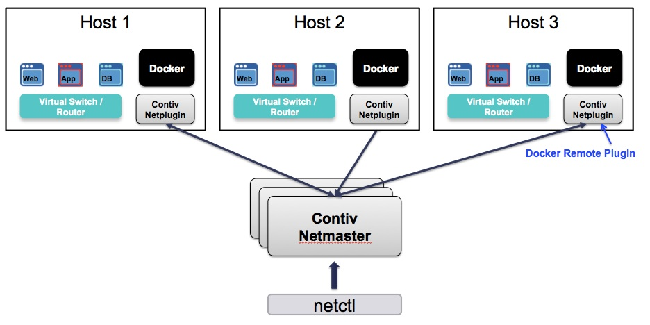
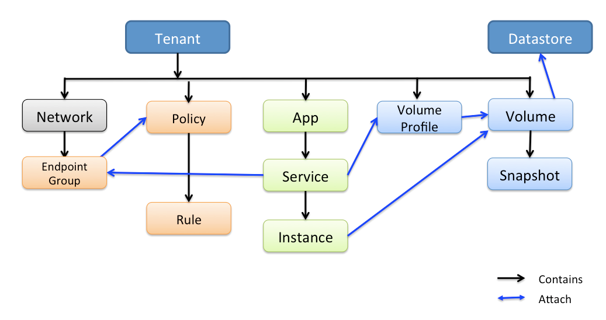

# netplugin

## About
Contiv netplugin is a generic networking plugin that is designed to provide multi host policy based networking for containerized applications.

Netplugin is designed to be used with docker containers and with cluster schedulers like Swarm, Kubernetes and Mesos

## Getting started
This section will walk you through how to try netplugin in a vagrant environment
### Prerequisits
- VirtualBox 5.0.2 or greater
- Vagrant 1.7.4
- Go 1.5.0

### Quick start guide
Clone the repo and bring up the VMs
```
$ git clone https://github.com/contiv/netplugin
$ cd netplugin; make demo
$ vagrant ssh netplugin-node1
```
This brings up a cluster of two VMs running docker and netplugin

#### Step 1: Create a network
```
netplugin-node1$ netctl net create contiv-net --subnet=20.1.1.0/24 --gateway=20.1.1.254 --pkt-tag=1001
```

#### Step 2: Run containers on two hosts
On node1
```
netplugin-node1$ docker run -itd --name=web --net=contiv-net ubuntu /bin/bash
```

On node2
```
netplugin-node2$ docker run -itd --name=db --net=contiv-net ubuntu /bin/bash
```

On node1, login to the container and ping the container on node2
```
netplugin-node1$ docker exec -it web /bin/bash
< inside the container >
root@f90e7fd409c4:/# ping db
PING db (20.1.1.3) 56(84) bytes of data.
64 bytes from db (20.1.1.3): icmp_seq=1 ttl=64 time=0.658 ms
64 bytes from db (20.1.1.3): icmp_seq=2 ttl=64 time=0.103 ms
```


## Architecture
#### Glossary
- *Netmaster*: Netmaster is the master daemon that is responsible for storing the Intent and distributing state to all nodes in the cluster.
- *Netplugin*: Netplugin is a long running daemon on every node in the cluster. As a docker network plugin, it is responsible for setting up network and policy for each container.
-  *Netctl*: netctl is a command line tool to moidfy the intent.


#### Netplugin architecture



### Contiv object model
Contiv object model provides a way for users to specify their Intent. Netmaster provides a REST api to view and modify contiv object model. Netctl commandline tool is a convinient utility to interact with the object model



From networking perspective, objects of interest are tenant, network, endpoint-group, policy and rules.

#### Tenant
Tenant is the top level object that represents a tenant in a multi tenant environment. It could be an organization, a business unit or a project. Anything that requires complete isolation between its networks would be considered a tenant.
#### Network
Network represents an L3 network similar to a virtual private cloud or a VRF. Contiv networks are large L3 domains where packets are routed by IP address without any ARP broadcasting.
#### Endpoint group
Endpoint groups are an arbitrary grouping of containers which belong to same policy domain. An endpoint group generally represents a microservice, a tier in an application stack or set of containers belonging to same framework or job.
#### Policy
Policy represents a network security policy that can be applied to an endpoint group. Policy contains a list of rules.
#### Rule
Rule is made up of match conditions(IP address, port, network, endpoint groups) and action(allow or deny). Rules are generally stateful. For example, "deny incoming tcp" denies all incoming TCP connections not packets. Incoming TCP packet for an already established connection will be allowed.

## Using Policies

Using policies with containers requires (1) creating a policy (2) adding rules to a policy (3) creating an endpoint group (4) attaching containers to the endpoint group. Lets walk thorough each of these steps.

#### Step1: Create a policy
Following creates a policy named `prod_web`
```
$ netctl policy create prod_web
```

#### Step 2: Add rules to the policy
Following adds a default-deny rule to drop all incoming TCP connections and two specific rules to allow traffic on port 80 and 443
```
$ netctl rule add prod_web 1 -direction=in -protocol=tcp -action=deny
$ netctl rule add prod_web 2 -direction=in -protocol=tcp -port=80 -action=accept -priority=10
$ netctl rule add prod_web 3 -direction=in -protocol=tcp -port=443 -action=accept -priority=10
```
#### Step 3: Create an endpoint group
Following command creates an endpoint group named `web` in network `contiv-net` and attaches `prod_web` policy to it
```
$ netctl group create contiv-net web -policy=prod_web
```

*Note*: Each endpoint group will create a seperate docker network of the form <endpoint-group-name>.<network-name> You can attach containers to these endpoint groups using `--net` option in `docker run` command

#### Step 4: Run a container and attach it to the endpoint group
Following runs a docker container and attaches it to `web` endpoint group in `contiv-net` network

```
$ docker run -itd --net web.contiv-net ubuntu bash
```

## Using Netplugin with Docker Swarm

Docker Swarm is a scheduler that schedules containers to multiple hosts. Netplugin is a docker network plugin that provides multi host networking.

Docker + Swarm + Netplugin == Awesome!!

### Using swarm
Netplugin vagrant setup comes pre-installed with docker swarm.
Set the following environment variable to make docker client talk to Swarm
```
export DOCKER_HOST=tcp://192.168.2.10:2375
```
Now, you should be able to see the information about the swarm cluster
```
$ docker info
Containers: 0
Images: 5
Engine Version:
Role: primary
Strategy: spread
Filters: affinity, health, constraint, port, dependency
Nodes: 2
 netplugin-node1: 192.168.2.10:2385
  └ Containers: 0
  └ Reserved CPUs: 0 / 4
  └ Reserved Memory: 0 B / 2.051 GiB
  └ Labels: executiondriver=native-0.2, kernelversion=4.0.0-040000-generic, operatingsystem=Ubuntu 15.04, storagedriver=devicemapper
 netplugin-node2: 192.168.2.11:2385
  └ Containers: 0
  └ Reserved CPUs: 0 / 4
  └ Reserved Memory: 0 B / 2.051 GiB
  └ Labels: executiondriver=native-0.2, kernelversion=4.0.0-040000-generic, operatingsystem=Ubuntu 15.04, storagedriver=devicemapper
CPUs: 8
Total Memory: 4.103 GiB
Name: netplugin-node1
No Proxy: 192.168.0.0/16,localhost,127.0.0.0/8
```

Next, you can see if there are any containers running in the cluster
```
$ docker ps
CONTAINER ID        IMAGE                          COMMAND             CREATED             STATUS              PORTS               NAMES
4dd09bc36875        ubuntu                         "bash"              52 minutes ago      Up 52 minutes                           netplugin-node1/reverent_allen
18bdc2cde778        skynetservices/skydns:latest   "/skydns"           3 hours ago         Up 3 hours          53/udp, 53/tcp      netplugin-node1/defaultdns

```

You can run containers and attach them to contiv networks or endpoint groups just like before.
```
$ docker run -itd --net web.contiv-net ubuntu bash
f291e269b45a5877f6fc952317feb329e12a99bda3a44a740b4c3307ef87954c
```
Here, `docker run` happens against the swarm cluster. Swarm schedules the container to one of the nodes and netplugin on that node sets up the networking and policies just like before.


## Service discovery
Contiv network provides built in service discovery for all containers in the network. Unlike traditional service discovery tools which require applications to query external KV stores for container IP/port information, contiv service discovery uses standard DNS protocol and requires no changes to the application.

When a container is attached to an endpoint group, it automatically becomes reachable by DNS service name. In the example above, we ran a container and attached it to `web` endpoint group. This container becomes available by DNS name `web` for all other containers in the same network. It would be available as `web.contiv-net` for all containers in other networks within the same tenant. If there are multiple containers in same endpoint group, all of them would be available by same DNS service name. DNS queries will be load balanced across all containers in the group.

## Multi tenancy

## Using Netplugin on baremetal servers

## Using Netplugin with Kubernetes

## Working with Cisco ACI
